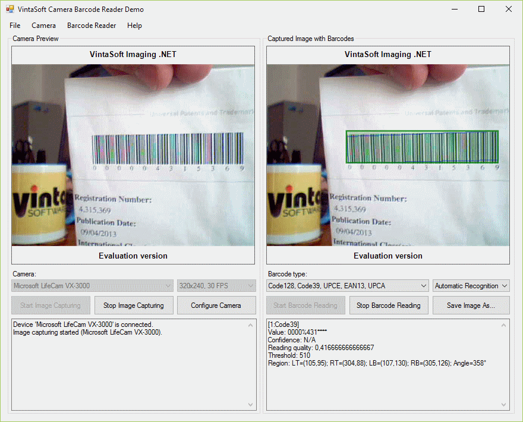

# VintaSoft WinForms Camera Barcode Reader Demo

This C# project uses <a href="https://www.vintasoft.com/vsimaging-dotnet-index.html">VintaSoft Imaging .NET SDK</a> and demonstrates how to recognize barcodes from camera stream:
* Get a list of available webcams.
* Select and configure webcam.
* Preview video from webcam.
* Capture image from webcam.
* Read barcodes from captured image.


## Screenshot



## Usage
1. Get the 30 day free evaluation license for <a href="https://www.vintasoft.com/vsimaging-dotnet-index.html" target="_blank">VintaSoft Imaging .NET SDK</a> here: <a href="https://myaccount.vintasoft.com/user/getEvaluationLicense" target="_blank">https://myaccount.vintasoft.com/user/getEvaluationLicense</a>

2. Update the evaluation license in "CSharp\MainForm.cs" file:
   ```
   Vintasoft.Imaging.ImagingGlobalSettings.Register("REG_USER", "REG_EMAIL", "EXPIRATION_DATE", "REG_CODE");
   ```

3. Build the project ("CameraBarcodeReaderDemo.Net10.csproj" file) in Visual Studio or using .NET CLI:
   ```
   dotnet build CameraBarcodeReaderDemo.Net10.csproj
   ```

4. Run compiled application and try to recognize barcodes from camera stream.


## Documentation
VintaSoft Imaging .NET SDK on-line User Guide and API Reference for .NET developer is available here: https://www.vintasoft.com/docs/vsimaging-dotnet/


## Support
Please visit our <a href="https://myaccount.vintasoft.com/">online support center</a> if you have any question or problem.
